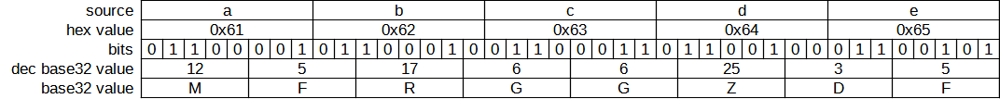

# GNU coreutils base32 reimplementation in rust

As this is a part of a practice project, the whole conversion from-to base32 is
implemented from scratch.

The behavior should match the coreutils variant, but error messages and help
text are different.

Here's a schema of how bits are moved during the conversion:

